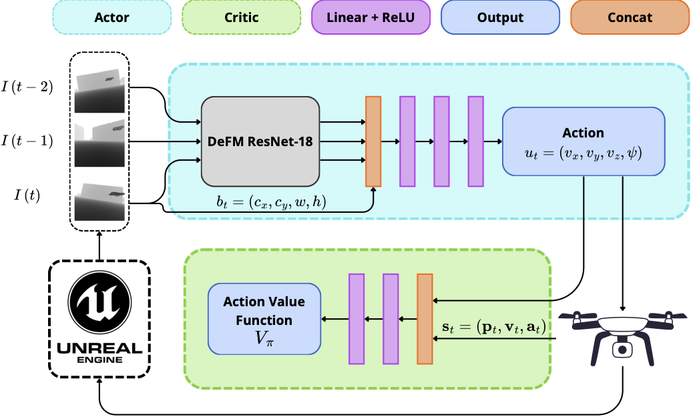

# Visual Target Tracking for UAVs Using Deep Reinforcement Learning

Bachelor's thesis project implementing an autonomous UAV visual target tracking system using deep reinforcement learning in the AirSim simulator.

## Abstract

Each day brings new discoveries and technological advances, and research on Unmanned Aerial Vehicles (UAVs) is one such area. Target tracking is a task common to many applications, including agriculture, surveillance, exploration, search-and-rescue, and defense, making robust, generalizable performance increasingly relevant. To date, the combination of perceptual robustness and end-to-end learned control remains underexplored, particularly for aerial platforms.

This thesis presents an approach that advances this direction of research, building on the D-VAT architecture with two key adjustments: depth observations replace RGB inputs to reduce sensitivity to lighting and weather, and a depth foundation model based on ResNet-18 is used as the visual backbone to leverage extensive depth-domain pretraining. Training is performed in an AirSim simulation environment built on Unreal Engine, where the agent interacts with its surroundings to collect experience. As an additional contribution, we provide a reproducible training setup on cloud GPU instances using vast.ai, with headless AirSim, persistent checkpoint storage, and resumable training.

The proposed approach is evaluated across four distinct trajectory types and four environmental conditions, the latter chosen specifically to test the robustness of the depth modality. The results show that the agent successfully detects the target across all conditions. However, it maintains a larger tracking distance than the baseline and would benefit from additional training. This work serves as a foundation for future sim-to-real transfer; the focus of the current work is on developing and evaluating the proposed approach in simulation.

## Architecture

The system uses an **asymmetric SAC policy** where the actor and critic observe different information:



**Key design choices:**
- **Depth input**: Invariant to lighting, weather, and texture changes
- **DeFM backbone**: Pretrained on metric depth estimation, frozen early layers preserve learned depth representations
- **Bounding box**: Oracle-detected target bounding box (cx, cy, w, h) normalized to [0, 1], concatenated with depth features to provide explicit target localization to the actor

## Documentation

- [Setup Guide](docs/setup_guide.md) — Project installation and usage instructions
- [AirSim Setup Guide](docs/airsim_setup_guide.md) — Building AirSim with UE 4.27 on macOS

## License

This project is licensed under the MIT License. See [LICENSE](LICENSE) for details.

## References

### DeFM (Depth Foundation Model)

```bibtex
@misc{patel2026defm,
      title={DeFM: Learning Foundation Representations from Depth for Robotics}, 
      author={Manthan Patel and Jonas Frey and Mayank Mittal and Fan Yang and Alexander Hansson and Amir Bar and Cesar Cadena and Marco Hutter},
      year={2026},
      eprint={2601.18923},
      archivePrefix={arXiv},
      primaryClass={cs.RO},
      url={https://arxiv.org/abs/2601.18923}, 
}
```

### D-VAT (Visual Active Tracking)

```bibtex
@article{dionigi2024d,
  title={D-VAT: End-to-End Visual Active Tracking for Micro Aerial Vehicles},
  author={Dionigi, Alberto and Felicioni, Simone and Leomanni, Mirko and Costante, Gabriele},
  journal={IEEE Robotics and Automation Letters},
  year={2024},
  publisher={IEEE}
}
```

### AirSim

```bibtex
@inproceedings{shah2018airsim,
  title={AirSim: High-Fidelity Visual and Physical Simulation for Autonomous Vehicles},
  author={Shah, Shital and Dey, Debadeepta and Lovett, Chris and Kapoor, Ashish},
  booktitle={Field and Service Robotics},
  year={2018},
  publisher={Springer}
}
```
